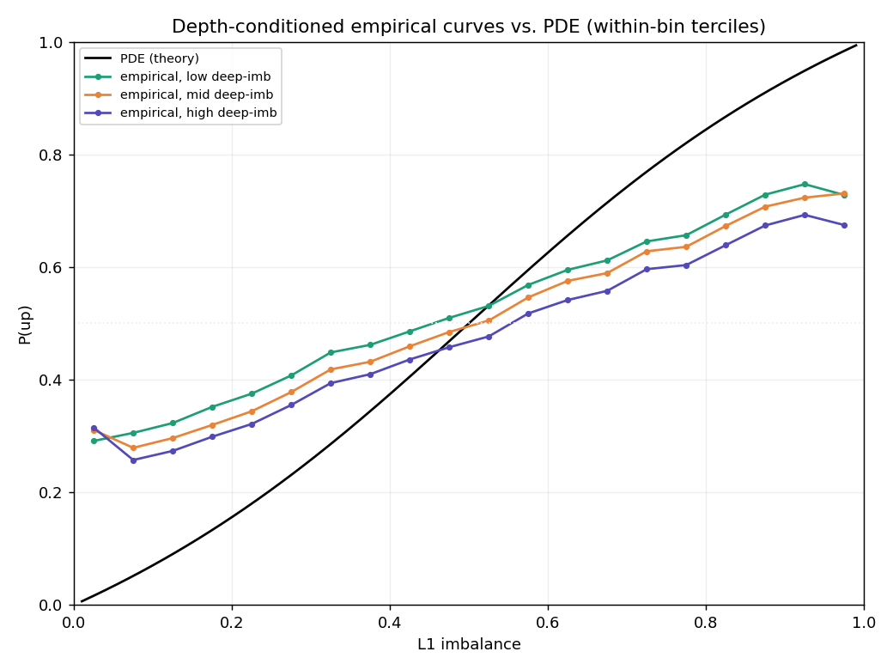
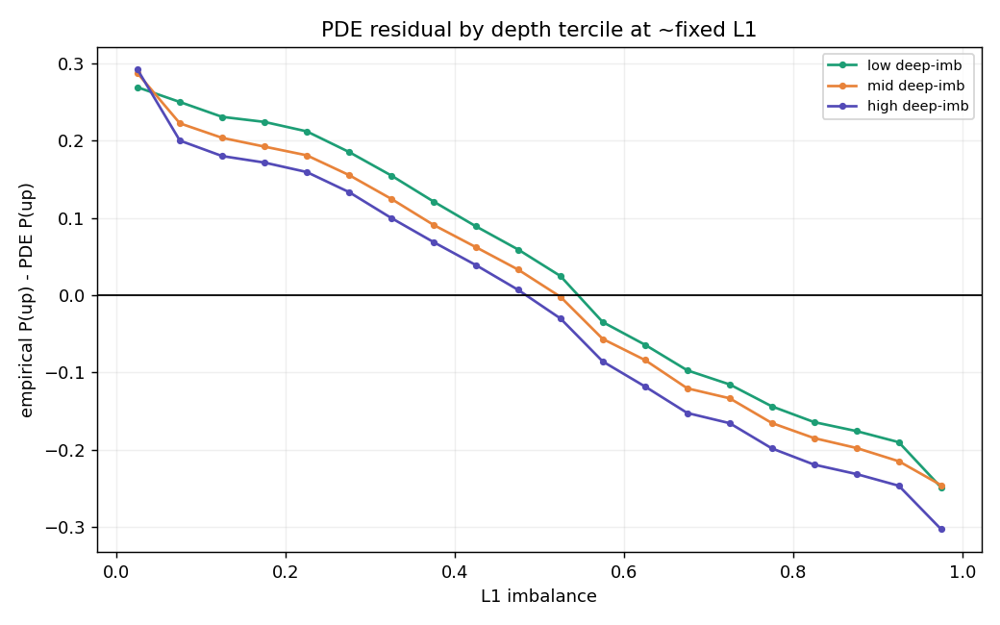
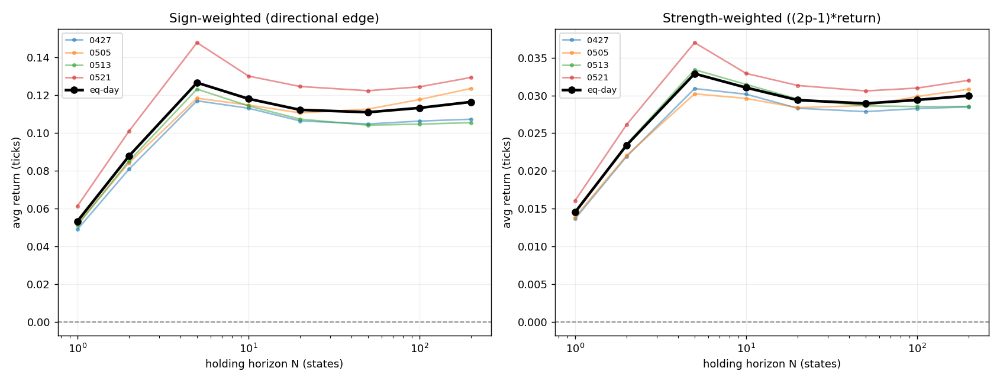

# OrderFlow Reactor

**Investigating whether queue imbalance in the MNQ limit order book contains economically exploitable predictive information, from L3 reconstruction through a parameter-free queueing model, a depth-signal investigation, and a transaction-cost backtest.**

A fundamental question in market microstructure is how the distribution of liquidity in the limit order book influences the direction of the next price move, and whether any resulting predictive signal survives realistic execution costs. This project reconstructs the CME MNQ order book from event-level market-by-order data, measures the relationship between queue imbalance and future price movements, tests it against a parameter-free queueing-theoretic prediction, investigates whether deeper book liquidity explains the residual, measures how long the signal persists, and finally evaluates whether it can be monetized after crossing the spread.

`P(up before down | book state)` is the probability that the mid-price ticks up before it ticks down, given the current order-book state. This is the object studied throughout: first as a prediction problem, then as a trading signal.

The framing is deliberately a *research* question ("does imbalance carry economically exploitable information?"), not a claim to a profitable strategy. The honest answer found here is: the signal is real, statistically robust, and persistent, but does **not** survive realistic taker execution costs by a wide margin.

---

## Key findings

**Takeaway:** Queue imbalance carries real, stable, out-of-sample directional information in MNQ. A parameter-free queueing (PDE) model captures its shape but systematically overstates confidence. Deeper book liquidity adds independent predictive value but does not explain that gap. The signal's edge is realized within ~5–10 book updates and amounts to 0.13–0.23 ticks per trade, which does **not** survive the ~1.8-tick round-trip spread cost. The information is genuine but not economically exploitable by crossing the spread.

The eight linked findings, each motivating the next:
1. **Reconstruction**: full L3 book rebuilt from 100M+ MBO events; 46.7M-record session validated with zero anomalies.
2. **Empirical curve**: the imbalance→direction relationship, reproduced on CME futures.
3. **Multi-day stability**: that curve is stable across four sessions (per-bin std < 0.011).
4. **PDE gap**: the parameter-free queueing model is systematically too steep (MAE 0.14).
5. **Depth signal**: deeper (levels 2–10) imbalance carries a robust *contrarian* signal beyond L1.
6. **Depth vs. gap**: depth improves out-of-sample forecasts but does **not** explain the PDE gap.
7. **Edge persistence**: the signal's directional edge is realized within ~5–10 book updates.
8. **Execution**: gross edge 0.13–0.23 ticks/trade does not survive the ~1.8-tick spread; break-even cost ≈ 0.13–0.23 ticks.

### Scale

| Metric | Value |
|---|---|
| Sessions | 4 (2026-04-27, 05-05, 05-13, 05-21) |
| Raw MBO events | 100M+ |
| Labeled states | 88M+ |
| Instrument | MNQ continuous front-month |
| Venue | CME Globex (GLBX.MDP3) |
| Data type | Market-by-order (L3) |

### Figures


---

## Repository

```
README.md           Project overview and results
requirements.txt    Dependencies
book.py             L3 order-book reconstruction + validation
record_states.py    State extraction (+ L10 depth)
label.py            First-passage labeling
calibrate.py        Empirical calibration curve
overlay.py          Empirical vs. theory (single session)
overlay_multi.py    Per-day curves, mean/band, gap table
batch.py            Multi-day pipeline
correlation.py      Queue-increment correlation
depth_residual.py   Depth signal within fixed L1 bins (contrarian finding)
depth_robustness.py Multi-day robustness of the depth signal
phase2_brier.py     L1 vs L1+depth out-of-sample Brier (leave-one-day-out)
depth_vs_pde.py     PDE vs L1 vs L1+depth; depth-conditioned residuals
edge_decay.py       Signal persistence vs holding horizon
backtest_stage1.py  Gross directional value (threshold sweep, no costs)
backtest_stage2.py  Net of spread cost; break-even transaction cost
thickness_test.py   Total book volume (thickness) conditioning test (null)
figures/            Project figures
```

**Pipeline:** raw `.dbn.zst` → `record_states` → `label` → `calibrate` / `overlay`. Multi-day: `batch` → `overlay_multi`. Depth: `depth_residual` → `depth_robustness` → `phase2_brier` → `depth_vs_pde`. Trading: `edge_decay` → `backtest_stage1` → `backtest_stage2`.

---

## 1. Research question

Electronic markets can be viewed as queueing systems. Orders are constantly added, canceled, and executed, and prices move when liquidity at the best bid or ask is exhausted. Previous studies have found that queue imbalance (the relative size of the bid and ask queues) contains information about the direction of the next price move. Queueing models go a step further by providing a closed-form prediction for that probability using only the sizes of the two queues.

This project studies two questions using CME MNQ futures data:

1. Does queue imbalance predict the direction of the next mid-price move?
2. Does a parameter-free queue-depletion model accurately reproduce that relationship?

The first question is already well understood in the literature and serves mainly as a benchmark. The main goal is the second: to compare a first-principles theoretical prediction against real market data and see where it matches reality and where it falls short.

---

## 2. Data

| | |
|---|---|
| Instrument | MNQ continuous front-month (`MNQ_c_0`) |
| Venue | CME Globex (GLBX.MDP3) |
| Schema | Market-by-order (MBO / L3) |
| Period | 2026-04-27, 2026-05-05, 2026-05-13, 2026-05-21 |
| Provider | Databento |

MBO is the most detailed market-data schema available, containing individual order adds, cancels, modifies, and executions keyed by order ID. Top-of-book queue sizes are reconstructed from it. The full ten levels of depth are also reconstructed and stored, and are used in the depth investigation in §5.

**Data access.** Raw CME MBO data was obtained through Databento and is not redistributed in this repository. Reproducing the analysis requires access to the corresponding MNQ market-by-order datasets.

**Reproducing results:**
1. Install dependencies: `pip install -r requirements.txt`
2. Obtain the MNQ MBO `.dbn.zst` files from Databento and set the paths at the top of the scripts (or `batch.py`).
3. Run the pipeline: `python batch.py` then `python overlay_multi.py` (single day: `record_states.py` → `label.py` → `calibrate.py` / `overlay.py`).
4. Optional: `python correlation.py` for the queue-increment correlation.

---

## 3. Method

### 3.1 Order book reconstruction

The raw Databento MBO feed does not provide an order book directly. Instead, it consists of a stream of add, cancel, modify, and reset messages that must be applied sequentially to reconstruct the book state. To do this, the system keeps track of every active order by ID, along with its side, price, and size. It also maintains price-sorted bid and ask books that store the total quantity available at each price level.

As events arrive, the book is updated according to Databento's documented semantics. Add (A), cancel (C), modify (M), and reset (R) messages change the book state, while trade and fill messages do not directly modify the book because their effects are already reflected through accompanying cancels. The book is sampled only after records carrying the `F_LAST` flag, to ensure each snapshot reflects a fully processed exchange event.

As a consistency check, active orders were periodically re-aggregated by price level and compared against the reconstructed bid and ask books. On the 2026-05-21 session (46.7 million records), the reconstruction completed with no validation failures, negative levels, or unknown order references.

### 3.2 Recording book states

The full order book changes millions of times throughout the trading day, so instead of storing every event, a new state is recorded only when the top of the book changes: any change to the best bid or best ask price or size.

Each recorded state contains:
- Timestamp
- Best bid and ask prices
- Best bid and ask sizes
- Mid-price
- Queue imbalance
- Top ten bid levels
- Top ten ask levels

Because the mid-price can only change when the top of the book changes, this captures the complete mid-price path while reducing the dataset size substantially.

### 3.3 Labeling the next price move

Each recorded state is labeled according to the direction of the next mid-price move. Starting from a given state, the algorithm looks forward until it finds the next different mid-price. If that price is higher, the state is labeled +1; if lower, −1. States at the very end of the trading session with no future price move are dropped.

This produces a first-passage label: simply whether the next move is up or down.

### 3.4 Imbalance and structural prediction

Queue imbalance is defined as

```
I = q_b / (q_b + q_a)
```

where `q_b` and `q_a` are the sizes of the best bid and best ask queues.

For each recorded state, the imbalance is computed and assigned to one of 20 bins. Within each bin, the fraction of states whose next price move is upward gives an empirical estimate of `P(up | I)`.

This empirical relationship is then compared against a parameter-free queue-depletion model from Cont–de Larrard. Under the assumption that the bid and ask queues evolve independently, the probability that the ask queue depletes before the bid queue has the closed-form solution

```
P(up | I) = 1 − (2/π) · arctan((1 − I)/I)
```

No parameters are fitted or calibrated. The theoretical curve is overlaid directly on the empirical curve, and the gap between the two is analyzed.

---

## 4. Results

### 4.1 The empirical curve reproduces the known relationship

Queue imbalance is strongly associated with the direction of the next price move. After grouping states into 20 imbalance bins, the probability of an upward move increases monotonically from approximately 0.31 in low-imbalance regimes (thin bid, thick ask) to approximately 0.70 in high-imbalance regimes (thick bid, thin ask). The curve crosses 0.50 near balanced queues, consistent with the relationship documented by Gould and Bonart (2015).

Across all states, the aggregate fraction of upward moves is 0.501, indicating that the labeling procedure introduces no meaningful directional bias.

### 4.2 The relationship is stable across sessions

The analysis was repeated across four MNQ trading sessions spanning late April to late May 2026. Each session produced between 16.0 million and 27.7 million labeled states, with aggregate up-rates ranging from 0.500 to 0.502.

The calibration curves are remarkably consistent across days. In the well-populated middle of the imbalance distribution (0.175–0.875), the standard deviation of `P(up)` across sessions is below 0.011 and falls as low as 0.002 near balanced queues. Variability increases only at the most extreme imbalance values, where observations are relatively rare.

This suggests the imbalance–direction relationship is not a feature of a single trading session but a stable property of MNQ order-book dynamics over the sample period.

### 4.3 The model gets the shape right, but is too confident

The empirical calibration curve was compared against the parameter-free queue-depletion prediction `P(up | I) = 1 − (2/π)·arctan((1 − I)/I)`.

The model gets the broad picture right. As imbalance increases, both the theory and the data assign a higher probability to an upward move, and both cross the 50% level near balanced queues. In the data, the empirical curve crosses 0.50 at an imbalance of about 0.475.

Where the model falls short is in the strength of the signal. At low imbalance values it predicts probabilities that are too low, and at high imbalance values it predicts probabilities that are too high: the theoretical curve is consistently steeper than the one observed in the data. The same pattern appears across all four sessions: theory sits below the empirical curve when imbalance is less than 0.5 and above it when imbalance is greater than 0.5. The empirical curve is effectively a flatter version of the theoretical one.

| Imbalance | Mean P(up) | Std | Theory | Gap |
|---:|---:|---:|---:|---:|
| 0.125 | 0.298 | 0.011 | 0.090 | +0.208 |
| 0.225 | 0.369 | 0.008 | 0.180 | +0.190 |
| 0.325 | 0.418 | 0.007 | 0.286 | +0.133 |
| 0.425 | 0.466 | 0.005 | 0.405 | +0.061 |
| 0.475 | 0.499 | 0.002 | 0.468 | +0.031 |
| 0.525 | 0.518 | 0.003 | 0.532 | −0.013 |
| 0.625 | 0.571 | 0.005 | 0.656 | −0.085 |
| 0.725 | 0.626 | 0.005 | 0.769 | −0.143 |
| 0.825 | 0.680 | 0.005 | 0.867 | −0.187 |
| 0.875 | 0.706 | 0.008 | 0.910 | −0.204 |

The error statistics tell the same story. The mean signed error is only +0.006, but that number is misleading because positive and negative errors cancel out. In absolute terms, the model is off by 0.140 on average, with the largest deviations reaching 0.238 in the most imbalanced states.

| Metric | Value |
|---|---|
| Mean signed error | +0.006 |
| Mean absolute deviation | 0.140 |
| RMSE | 0.156 |
| Maximum absolute deviation | 0.238 |

The model gets the direction of the relationship right (larger bid queues make upward moves more likely) and places the 50/50 crossing point in roughly the right place. Where it falls short is the strength of the effect: across all four sessions, the theoretical curve is consistently steeper than the empirical one, predicting probabilities more extreme than those seen in the data.

The sections below investigate the leading candidate explanation for this gap (deeper book liquidity, §5), then measure how long the signal persists (§6), test whether it survives execution costs (§7), and interpret the residual (§8).

---

## 5. Does deeper liquidity explain the gap?

The independent-queue model uses only the best bid and ask. A natural hypothesis is that liquidity deeper in the book (levels 2–10) carries information that would explain the too-steep gap. This was investigated in three steps.

**Depth carries a contrarian signal.** Within each fixed L1-imbalance bin, states were split by their cumulative levels 2–10 imbalance. Holding top-of-book imbalance fixed, states with *more* deep bid support went up *less* often, a stable spread of about −0.04, consistent across all four sessions, with negligible residual L1 difference between the groups (max |L1 gap| < 0.003). Resting deep liquidity behaves as passive/contrarian, not directional: the opposite sign to top-of-book imbalance.

**Depth improves out-of-sample forecasts.** A leave-one-day-out Brier comparison of an L1-only predictor against an L1+depth predictor (with count-weighted shrinkage of sparse joint buckets) found depth improved held-out forecasts on all four folds, by a small but consistent margin (mean Brier improvement ≈ 0.0005, 100% joint-bucket coverage, log-loss agreeing). The improvement is small (as expected, since depth and L1 overlap) but robust in sign across every fold.

**But depth does not explain the aggregate gap.** Comparing the parameter-free PDE, empirical L1, and empirical L1+depth predictors on the same held-out days shows depth's share of the total Brier improvement over the PDE benchmark. Crucially, conditioning on depth *cannot* change the aggregate empirical curve (by the averaging identity `E[P(up|I,D)|I] = P(up|I)`), so the too-steep gap is a property of `P(up|I)` itself. The depth-conditioned residual plots confirm this: within each L1 bin, low/mid/high depth curves all remain on the *same side* of the PDE (they shift the level, not the slope). Depth is genuinely predictive but does not account for the theoretical discrepancy, which points instead at the PDE's other assumptions: non-Poisson/clustered arrivals, non-Markovian state, or non-stationary intensities.

**Total book volume adds nothing.** Depth *imbalance* (a ratio) is distinct from total book *volume* (a magnitude). A separate test asked whether book thickness (total resting size, which the imbalance ratio discards) conditions the signal. Within each imbalance bin, states were split into thin / normal / thick books (by standard-deviation buckets) and P(up) compared, at three depth ranges (level 1, levels 1–2, levels 1–5). The thick-minus-thin spread was near zero and inconsistent in sign at every depth range (mean |spread| < 0.006, never same-sign across bins), and what little appeared was confounded by residual imbalance in the split. Total volume carries no directional information beyond the imbalance ratio: the book's *balance* predicts direction, its *magnitude* does not.

This investigation also illustrates that not all intuitive order-book features are informative: while deeper imbalance carries independent predictive value, total resting volume does not. The direction of liquidity matters more than its magnitude.





---

## 6. How long does the signal last?

Before treating the signal as tradable, its persistence was measured directly, to choose a holding horizon from data rather than by assumption. For each horizon N (in future book-state updates), the average signed forward return `sign(p̂−0.5)·(mid_{t+N}−mid_t)` was computed over all states, leave-one-day-out.

The cumulative directional edge rises quickly to a peak at N≈5 states and then plateaus flat out to N=200 (≈0.11–0.13 ticks), positive on all four days at every horizon. The move is realized within a few book updates and then held: it neither keeps growing nor reverses. Splitting by signal strength `|p̂−0.5|`, stronger signals carry a much larger edge (≈0.24 ticks for strong vs. ≈0.04 for weak at N=5) and persist just as long, which argues for a high confidence threshold.

This identifies **5–10 book updates** as the natural candidate holding range (the region where most of the cumulative edge is realized), and rules out arbitrarily long horizons.



---

## 7. Does the signal survive execution costs?

A threshold-swept, non-overlapping, leave-one-day-out backtest was run at the 5- and 10-state horizons. A position is opened when `p̂` crosses `0.5 ± τ`, held for N states, then closed; only one position is held at a time.

**Gross directional value is real and threshold-responsive.** Mid-to-mid gross edge rises from 0.13 ticks/trade at τ=0 to 0.23 ticks/trade at the highest threshold (N=5), positive on all four held-out days at every threshold, on 12–18M trades. Higher confidence thresholds produce fewer but higher-quality trades, exactly as expected. N=5 and N=10 give nearly identical per-trade edge, confirming the decay result.

**It does not survive the spread.** Applying the realized round-trip spread cost (crossing half the actual bid–ask spread on entry and exit) makes every configuration deeply unprofitable: net ≈ −1.6 ticks/trade across all thresholds and both horizons. The realized round-trip cost is ≈ 1.8 ticks, reflecting that MNQ trades at a ~2-tick median spread in this sample (17% of states one tick, 59% two ticks): a property of the whole book, not of the signal-selected states.

**Break-even transaction cost.** The strategy's break-even round-trip cost equals its gross edge: 0.13–0.23 ticks. Since a taker pays at minimum ~1 tick (in the 17% of states with a one-tick book) and ~1.8 ticks typically, the signal does **not** survive realistic taker execution costs, by roughly an order of magnitude, under any plausible spread assumption. The information is genuine and statistically robust but not economically exploitable by crossing the spread.

*(Caveat: the ~2-tick spread is taken from the reconstruction; confirming it against a reference BBO feed is a loose end. The economic conclusion holds under any spread ≥ 1 tick, so it does not depend on the exact figure.)*

---

## 8. Interpretation

The most interesting result is not that the theoretical curve misses the data, but *how* it misses. Across all four sessions, the empirical curve is consistently flatter than the independent-queue prediction. The gap is systematic rather than random.

One possible explanation is dependence between the bid and ask queues. If both sides of the book tend to grow and shrink together, the probability curve would be pulled toward 0.50, producing the same flattening. To test this, the correlation between changes in the best-bid and best-ask queue sizes was measured directly: `corr(Δq_b, Δq_a) ≈ 0.0002` across 27.5 million increments (2026-05-21), effectively zero.

This rules out the simplest dependence. Combined with the depth investigation (§5), which showed depth is predictive but does not explain the aggregate gap, the remaining discrepancy is most likely driven by assumptions the model makes and the market does not: clustered/self-exciting order flow, state-dependent arrival rates, longer-timescale dependence, or non-Markovian book state. Because the prediction contains no fitted parameters, the residual is interpretable: it points at specific omitted mechanisms rather than being absorbed by calibration.

---

## 9. Why is the edge capped? Predictability vs. exploitability

The central economic result is not that the signal loses money, but *why*, and the reason is structural, not a defect of the method.

The gross edge is capped near 0.23 ticks per trade. It is worth being precise about what does and does not explain this cap:

- **Not signal weakness.** The signal contains statistically significant directional information (at the highest threshold, roughly 42% of trades win, 49% are flat, 9% lose). But classification accuracy is not expected profit: what matters economically is `E[Δ price | signal]`, and that conditional expected move is small, because the mid moves in half-tick steps and the predictable component of the next move is a fraction of one.
- **Not the horizon.** The edge-decay curve (§6) plateaus after ~5 states; imbalance predicts the immediate move, not sustained drift, so holding longer does not grow the edge.
- **Not model underfit.** Richer models (logistic, gradient-boosted) might sharpen calibration marginally, but the depth Brier improvement was ~0.0005, nowhere near enough to turn 0.23 ticks into 1+.
- **Market efficiency.** At the millisecond-to-few-updates horizon where market makers and colocated firms compete, a simple public imbalance rule earning more than the spread would not persist. The predictable part of the next move is, by construction, smaller than the cost to capture it.

The takeaway: **queue imbalance contains statistically significant directional information, but the conditional expected price movement is small relative to transaction costs.** This illustrates the distinction between *statistical predictability* and *economic exploitability*: a signal can be genuinely predictive yet too small to trade as a taker after realistic costs. It also reframes imbalance not as a standalone strategy but as one feature in a richer microstructure model, and points at the real economic lever: execution (earning rather than paying the spread), not a larger raw edge.

---

## 10. Related work

The relationship between queue imbalance and the direction of the next price move is already well established. In this project it serves as a benchmark rather than the main result: the goal is not to show that imbalance predicts price movement, but to compare that empirical relationship against a theoretical prediction from a queueing model, characterize what it omits, and test whether the signal survives execution.

- **Gould & Bonart (2015)**: found that queue imbalance predicts short-horizon price direction in Nasdaq stocks, especially for large-tick instruments.
- **Cont, Stoikov & Talreja (2010)**: modeled the limit order book as a queueing system and linked price moves to the depletion of bid and ask queues.
- **Cont & de Larrard (2013)**: derived the diffusion-limit hitting-probability framework used here, expressing price-move probabilities in terms of queue sizes.

---

## 11. Limitations

The analysis covers four MNQ sessions from late April to late May 2026. The curve is highly stable across those days, but they represent a relatively narrow sample of market conditions. This project does not test whether the same relationship holds during major macroeconomic announcements, periods of extreme volatility, prolonged market trends, or in instruments outside MNQ.

The backtest models only the *taker* regime (crossing the spread). A maker strategy (posting passively to earn rather than pay the spread) faces adverse selection and is not evaluated here. The realized spread is taken from the reconstruction and not yet cross-checked against a reference BBO feed.

Statistical caveats are handled by cross-day replication rather than row-level significance testing: consecutive states share labels and forward-return windows overlap, so the honest evidence for each finding is its consistency across the four independent held-out days, not a single large sample size.

---

## 12. Future work

- **More data and regimes.** Extend from four sessions to months of data spanning different volatility regimes, to test robustness of the curve, the depth signal, and the execution conclusion.
- **Competing signals.** The signals tested here are built from *resting* book state. The genuinely different, untested class is *aggressive* flow: order-flow imbalance (OFI), trade/aggressor volume, and queue depletion rate, which requires recording the trade events the current pipeline discards. Compare these against L1 imbalance as competing hypotheses.
- **Flexible models.** Compare the empirical lookup against logistic regression, gradient-boosted trees, or sequence models out-of-sample, with feature importance: a smoother model may find structure the sparse buckets miss.
- **Why is the curve flatter?** Event-level queue correlation is ≈0 and depth does not explain the gap; the remaining candidates (clustered/self-exciting arrivals, non-stationary intensities, non-Markovian state) are each a testable experiment (e.g. longer-timescale correlation, time-bucketed arrival rates).
- **Maker execution.** Model passive posting with queue position and adverse selection, to test whether the signal that fails as a taker could be viable as a maker.
- **Spread verification.** Cross-check the reconstructed ~2-tick MNQ spread against a reference BBO feed.
