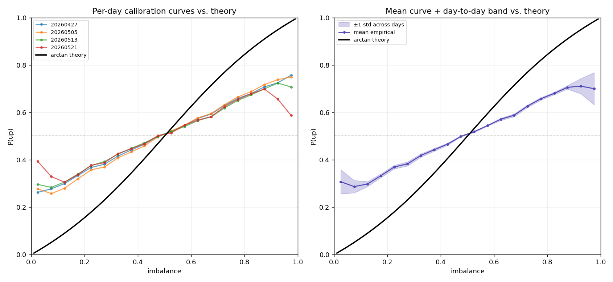
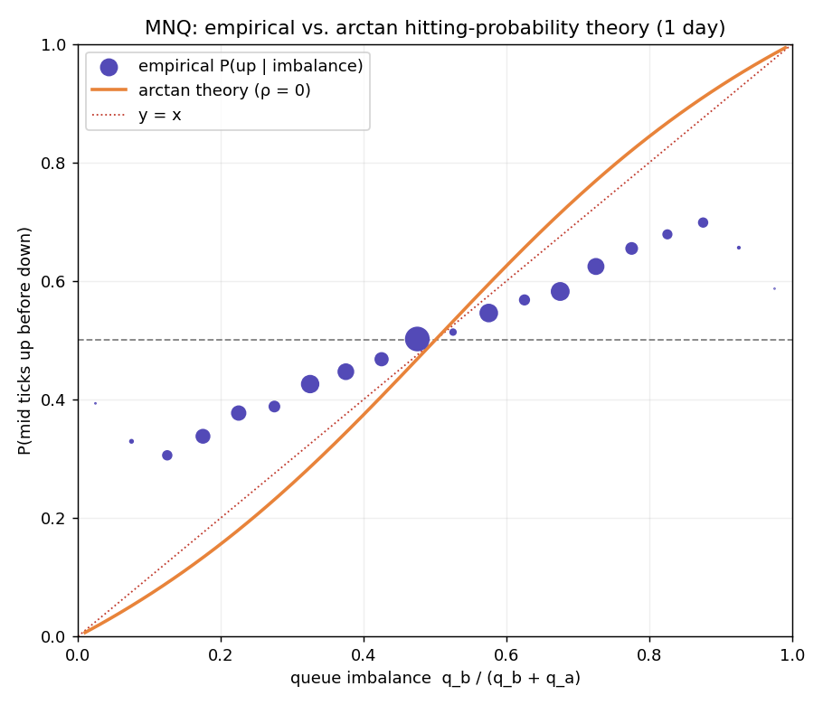

# OrderFlow Reactor

**Reconstructing the MNQ limit order book from market-by-order data and testing a queueing-theoretic (PDE) model of short-horizon price movement.**

A fundamental question in market microstructure is how the distribution of liquidity in the limit order book influences the direction of the next price move. This project reconstructs the CME MNQ order book from event-level market-by-order data, measures the relationship between queue imbalance and future price movements, and evaluates a parameter-free queueing-theoretic prediction against real market data.

`P(up before down | book state)` is the probability that the mid-price ticks up before it ticks down, given the current order-book state. If this probability can be estimated from observable liquidity, it provides actionable information for market makers deciding how to quote, manage inventory, and position within the limit order book.

---

## Key findings

**Takeaway:** The independent-queue PDE gets the direction and crossing point right but systematically overstates confidence. The empirical curve is a stable, flattened version of the theoretical prediction across multiple MNQ sessions.

**Data & engineering:**
- Reconstructed 100M+ order-book events from CME MNQ futures into a validated L3 book.
- Generated 88M+ first-passage up/down labels across four trading sessions.

**Empirical findings:**
- Reproduced the known monotonic relationship between queue imbalance and the direction of the next price move on CME futures.
- Compared the empirical curve against a parameter-free queueing/PDE model (the hitting-probability / harmonic-function prediction).
- The model gets the direction and the 50/50 crossing point right, but systematically overstates directional certainty — mean absolute deviation 0.14, up to 0.24 in extreme-imbalance regimes.
- The gap is stable across all four sessions (per-bin std < 0.011 in populated bins).

### Contribution beyond prior work

The imbalance–direction relationship is already established and serves as a benchmark. This project contributes:
- An independent full-L3 reconstruction on CME MNQ futures.
- Verification that the empirical imbalance–direction curve remains highly stable across four MNQ sessions spanning late April to late May 2026, with per-bin standard deviation below 0.011 in populated regions.
- A comparison of the empirical calibration curve against a parameter-free harmonic-function / hitting-probability prediction, quantifying a persistent flattening relative to theory.

### Scale

| Metric | Value |
|---|---|
| Sessions | 4 (2026-04-27, 05-05, 05-13, 05-21) |
| Raw MBO events | 100M+ |
| Labeled states | 88M+ |
| Instrument | MNQ continuous front-month |
| Venue | CME Globex (GLBX.MDP3) |
| Data type | Market-by-order (L3) |

### Figures





---

## Repository

```
README.md          Project overview and results
requirements.txt   Dependencies
book.py            L3 order-book reconstruction + validation
record_states.py   State extraction (+ L10 depth)
label.py           First-passage labeling
calibrate.py       Empirical calibration curve
overlay.py         Empirical vs. theory (single session)
overlay_multi.py   Per-day curves, mean/band, gap table
batch.py           Multi-day pipeline
correlation.py     Queue-increment correlation
figures/           Project figures
```

**Pipeline:** raw `.dbn.zst` → `record_states` → `label` → `calibrate` / `overlay`. Multi-day: `batch` → `overlay_multi`.

---

## 1. Research question

Electronic markets can be viewed as queueing systems. Orders are constantly added, canceled, and executed, and prices move when liquidity at the best bid or ask is exhausted. Previous studies have found that queue imbalance — the relative size of the bid and ask queues — contains information about the direction of the next price move. Queueing models go a step further by providing a closed-form prediction for that probability using only the sizes of the two queues.

This project studies two questions using CME MNQ futures data:

1. Does queue imbalance predict the direction of the next mid-price move?
2. Does a parameter-free queue-depletion model accurately reproduce that relationship?

The first question is already well understood in the literature and serves mainly as a benchmark. The main goal is the second: to compare a first-principles theoretical prediction against real market data and see where it matches reality and where it falls short.

---

## 2. Data

| | |
|---|---|
| Instrument | MNQ continuous front-month (`MNQ_c_0`) |
| Venue | CME Globex (GLBX.MDP3) |
| Schema | Market-by-order (MBO / L3) |
| Period | 2026-04-27, 2026-05-05, 2026-05-13, 2026-05-21 |
| Provider | Databento |

MBO is the most detailed market-data schema available, containing individual order adds, cancels, modifies, and executions keyed by order ID. Top-of-book queue sizes are reconstructed from it. The full ten levels of depth are also reconstructed and stored for the extensions described in §8.

**Data access.** Raw CME MBO data was obtained through Databento and is not redistributed in this repository. Reproducing the analysis requires access to the corresponding MNQ market-by-order datasets.

**Reproducing results:**
1. Install dependencies: `pip install -r requirements.txt`
2. Obtain the MNQ MBO `.dbn.zst` files from Databento and set the paths at the top of the scripts (or `batch.py`).
3. Run the pipeline: `python batch.py` then `python overlay_multi.py` (single day: `record_states.py` → `label.py` → `calibrate.py` / `overlay.py`).
4. Optional: `python correlation.py` for the queue-increment correlation.

---

## 3. Method

### 3.1 Order book reconstruction

The raw Databento MBO feed does not provide an order book directly. Instead, it consists of a stream of add, cancel, modify, and reset messages that must be applied sequentially to reconstruct the book state. To do this, the system keeps track of every active order by ID, along with its side, price, and size. It also maintains price-sorted bid and ask books that store the total quantity available at each price level.

As events arrive, the book is updated according to Databento's documented semantics. Add (A), cancel (C), modify (M), and reset (R) messages change the book state, while trade and fill messages do not directly modify the book because their effects are already reflected through accompanying cancels. The book is sampled only after records carrying the `F_LAST` flag, to ensure each snapshot reflects a fully processed exchange event.

As a consistency check, active orders were periodically re-aggregated by price level and compared against the reconstructed bid and ask books. On the 2026-05-21 session (46.7 million records), the reconstruction completed with no validation failures, negative levels, or unknown order references.

### 3.2 Recording book states

The full order book changes millions of times throughout the trading day, so instead of storing every event, a new state is recorded only when the top of the book changes — any change to the best bid or best ask price or size.

Each recorded state contains:
- Timestamp
- Best bid and ask prices
- Best bid and ask sizes
- Mid-price
- Queue imbalance
- Top ten bid levels
- Top ten ask levels

Because the mid-price can only change when the top of the book changes, this captures the complete mid-price path while reducing the dataset size substantially.

### 3.3 Labeling the next price move

Each recorded state is labeled according to the direction of the next mid-price move. Starting from a given state, the algorithm looks forward until it finds the next different mid-price. If that price is higher, the state is labeled +1; if lower, −1. States at the very end of the trading session with no future price move are dropped.

This produces a first-passage label: simply whether the next move is up or down.

### 3.4 Imbalance and structural prediction

Queue imbalance is defined as

```
I = q_b / (q_b + q_a)
```

where `q_b` and `q_a` are the sizes of the best bid and best ask queues.

For each recorded state, the imbalance is computed and assigned to one of 20 bins. Within each bin, the fraction of states whose next price move is upward gives an empirical estimate of `P(up | I)`.

This empirical relationship is then compared against a parameter-free queue-depletion model from Cont–de Larrard. Under the assumption that the bid and ask queues evolve independently, the probability that the ask queue depletes before the bid queue has the closed-form solution

```
P(up | I) = 1 − (2/π) · arctan((1 − I)/I)
```

No parameters are fitted or calibrated. The theoretical curve is overlaid directly on the empirical curve, and the gap between the two is analyzed.

---

## 4. Results

### 4.1 The empirical curve reproduces the known relationship

Queue imbalance is strongly associated with the direction of the next price move. After grouping states into 20 imbalance bins, the probability of an upward move increases monotonically from approximately 0.31 in low-imbalance regimes (thin bid, thick ask) to approximately 0.70 in high-imbalance regimes (thick bid, thin ask). The curve crosses 0.50 near balanced queues, consistent with the relationship documented by Gould and Bonart (2015).

Across all states, the aggregate fraction of upward moves is 0.501, indicating that the labeling procedure introduces no meaningful directional bias.

### 4.2 The relationship is stable across sessions

The analysis was repeated across four MNQ trading sessions spanning late April to late May 2026. Each session produced between 16.0 million and 27.7 million labeled states, with aggregate up-rates ranging from 0.500 to 0.502.

The calibration curves are remarkably consistent across days. In the well-populated middle of the imbalance distribution (0.175–0.875), the standard deviation of `P(up)` across sessions is below 0.011 and falls as low as 0.002 near balanced queues. Variability increases only at the most extreme imbalance values, where observations are relatively rare.

This suggests the imbalance–direction relationship is not a feature of a single trading session but a stable property of MNQ order-book dynamics over the sample period.

### 4.3 The model gets the shape right, but is too confident

The empirical calibration curve was compared against the parameter-free queue-depletion prediction `P(up | I) = 1 − (2/π)·arctan((1 − I)/I)`.

The model gets the broad picture right. As imbalance increases, both the theory and the data assign a higher probability to an upward move, and both cross the 50% level near balanced queues. In the data, the empirical curve crosses 0.50 at an imbalance of about 0.475.

Where the model falls short is in the strength of the signal. At low imbalance values it predicts probabilities that are too low, and at high imbalance values it predicts probabilities that are too high — the theoretical curve is consistently steeper than the one observed in the data. The same pattern appears across all four sessions: theory sits below the empirical curve when imbalance is less than 0.5 and above it when imbalance is greater than 0.5. The empirical curve is effectively a flatter version of the theoretical one.

| Imbalance | Mean P(up) | Std | Theory | Gap |
|---:|---:|---:|---:|---:|
| 0.125 | 0.298 | 0.011 | 0.090 | +0.208 |
| 0.225 | 0.369 | 0.008 | 0.180 | +0.190 |
| 0.325 | 0.418 | 0.007 | 0.286 | +0.133 |
| 0.425 | 0.466 | 0.005 | 0.405 | +0.061 |
| 0.475 | 0.499 | 0.002 | 0.468 | +0.031 |
| 0.525 | 0.518 | 0.003 | 0.532 | −0.013 |
| 0.625 | 0.571 | 0.005 | 0.656 | −0.085 |
| 0.725 | 0.626 | 0.005 | 0.769 | −0.143 |
| 0.825 | 0.680 | 0.005 | 0.867 | −0.187 |
| 0.875 | 0.706 | 0.008 | 0.910 | −0.204 |

The error statistics tell the same story. The mean signed error is only +0.006, but that number is misleading because positive and negative errors cancel out. In absolute terms, the model is off by 0.140 on average, with the largest deviations reaching 0.238 in the most imbalanced states.

| Metric | Value |
|---|---|
| Mean signed error | +0.006 |
| Mean absolute deviation | 0.140 |
| RMSE | 0.156 |
| Maximum absolute deviation | 0.238 |

The model gets the direction of the relationship right — larger bid queues make upward moves more likely — and places the 50/50 crossing point in roughly the right place. Where it falls short is the strength of the effect: across all four sessions, the theoretical curve is consistently steeper than the empirical one, predicting probabilities more extreme than those seen in the data.

---

## 5. Interpretation

The most interesting result is not that the theoretical curve misses the data, but *how* it misses. Across all four sessions, the empirical curve is consistently flatter than the independent-queue prediction. The gap is systematic rather than random, suggesting that some aspect of real order-book dynamics is missing from the model.

One possible explanation is dependence between the bid and ask queues. If both sides of the book tend to grow and shrink together, the probability curve would be pulled toward 0.50, producing the same flattening seen in the data. To test this, the correlation between changes in the best-bid and best-ask queue sizes was measured directly. The result, `corr(Δq_b, Δq_a) ≈ 0.0002` across 27.5 million increments on 2026-05-21, is effectively zero.

This does not rule out all forms of dependence, but it does rule out the simplest one. The remaining gap is likely driven by assumptions the model makes and the real market does not. Possible candidates include clustered order flow, state-dependent arrival rates, longer-timescale dependence, or information contained deeper in the book than the best bid and ask.

Because the prediction contains no fitted parameters, the residual is easy to interpret. Rather than being absorbed by calibration, the mismatch points directly to features of the market that the model omits. In that sense, the gap is the starting point for the next stage of the project.

---

## 6. Related work

The relationship between queue imbalance and the direction of the next price move is already well established. In this project it serves as a benchmark rather than the main result: the goal is not to show that imbalance predicts price movement, but to compare that empirical relationship against a theoretical prediction from a queueing model.

- **Gould & Bonart (2015)** — found that queue imbalance predicts short-horizon price direction in Nasdaq stocks, especially for large-tick instruments.
- **Cont, Stoikov & Talreja (2010)** — modeled the limit order book as a queueing system and linked price moves to the depletion of bid and ask queues.
- **Cont & de Larrard (2013)** — derived the diffusion-limit hitting-probability framework used here, expressing price-move probabilities in terms of queue sizes.

---

## 7. Limitations

The analysis covers four MNQ sessions from late April to late May 2026. The curve is highly stable across those days, but they represent a relatively narrow sample of market conditions. This project does not test whether the same relationship holds during major macroeconomic announcements, periods of extreme volatility, prolonged market trends, or in instruments outside MNQ.

The model is intentionally simple. It uses only the sizes of the best bid and best ask queues and assumes they evolve independently. Real order books are more complicated: order flow arrives in bursts, behavior changes throughout the trading day, and liquidity beyond the best level may also influence future price moves.

---

## 8. Future work

- **L10 depth.** This project uses only the best bid and ask, though the full ten levels of book depth were reconstructed and stored. The most interesting next question is whether deeper liquidity can explain the gap between the empirical curve and the theoretical prediction.
- **Machine learning.** The current comparison is between the empirical curve and a structural queueing model. Another direction is to train logistic regression, gradient-boosted trees, or other models on imbalance and depth features and compare their performance against the theory.
- **Why is the curve flatter?** The independent-queue model consistently predicts probabilities more extreme than those observed. Event-level queue correlations appear negligible, so the remaining gap may come from longer-timescale dependence, clustered order flow, or assumptions in the queueing model itself.
- **More trading days.** Running the same pipeline across a larger sample would show whether the results remain stable across different market conditions.
